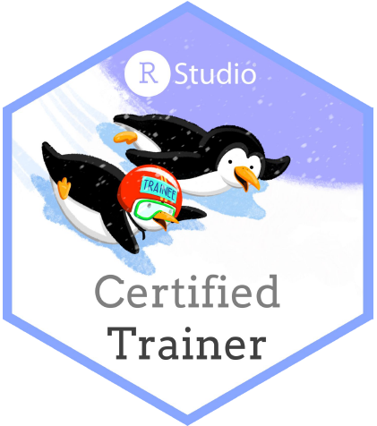

<!-- README.md is generated from README.Rmd. Please edit that file -->

<!-- magick::image_info(magick::image_read("img/CertifiedRstudioTrainer.png"))$height -->

# RStudio Trainer Certification teaching exam’s materials 

## (Meta)data texting in `{ggplot2}` 

This repository collect all the material I have prepared for my [RStudio
Instructor Certification](https://education.rstudio.com/trainers/)
Teaching Exam.

## Slides

The slides include:

  - learner persona (more
    [here](https://rstudio-education.github.io/learner-personas/) by
    RStudio)
  - learning objectives
  - concept maps (more [here](https://github.com/rstudio/concept-maps)
    from other RStudio Trainers)
  - links to formative assessments
  - presenter mode including the transcription of the lesson (just type
    “p” during the presentation)

<iframe src="https://corradolanera.github.io/rs-teaching-exam/" width="100%" height="400px">

</iframe>

## Assessments

The lesson include the following interactive `{learner}` assessments:

  - Warm-up quiz:
    [here](https://corradolanera.shinyapps.io/base-gg-checks/)
  - Formative and summative assessments:
    [here](https://corradolanera.shinyapps.io/test-gg-checks/)

## Certificate

<!-- -->

## License

 This
work is licensed under a
<a rel="license" href="http://creativecommons.org/licenses/by-sa/4.0/">Creative
Commons Attribution-ShareAlike 4.0 International License</a>.

**You are free, and welcome to share, adapt, and re-use at your
convenience\!** Just mention @CorradoLanera, and share your work the
same way.
