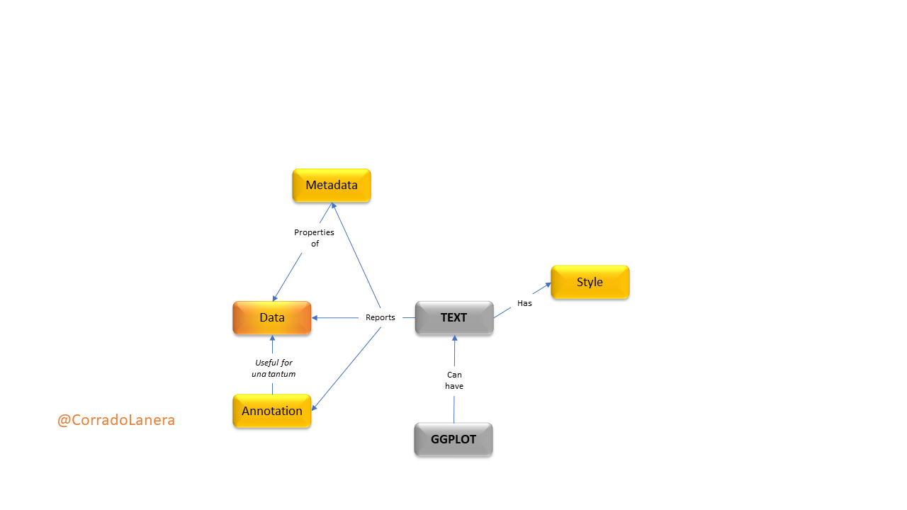
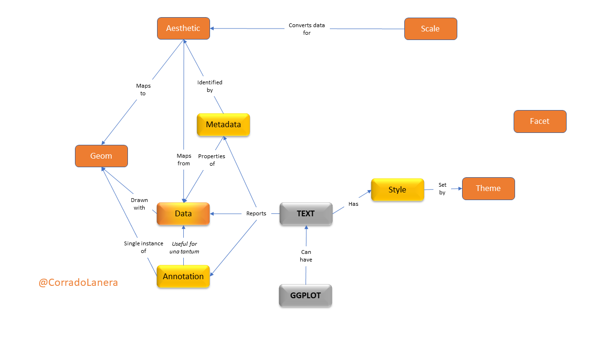
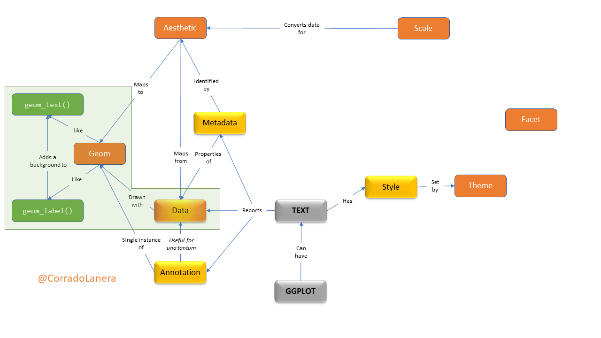
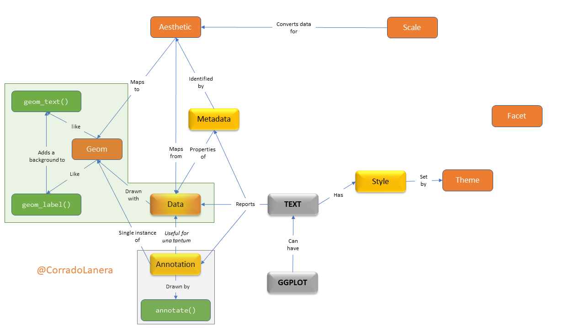
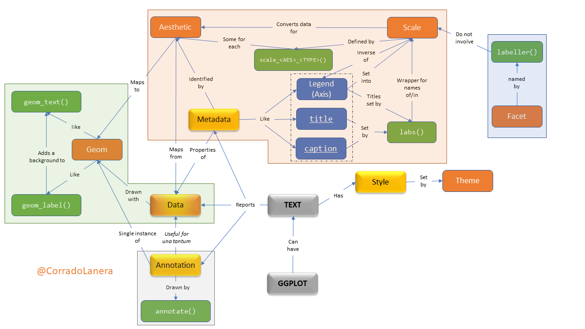
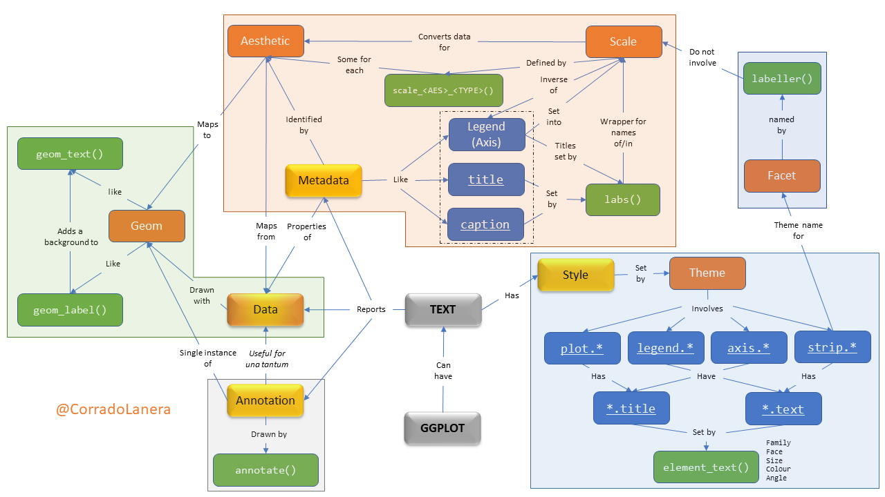

class: center, inverse

# **(Meta)data texting in `{ggplot2}`**
## an introduction to the usage of text with axes, legends, points, and plots.

<br>

```{r, echo=FALSE, out.width = "20%"}
knitr::include_graphics("img/gg-logo.png") 
```

<br>

#### @CorradoLanera

**RStudio Instructor Certification - Teaching exam - 2020/09/14**

```{r setup, echo=FALSE}
library(xaringanExtra)
library(metathis)
library(countdown)

knitr::opts_chunk$set(
  message = FALSE,
  comment = "",
  fig.dim  = c(5, 4.5),
  out.width = "100%"
)
options(width = 59) # fit into the rigth-column slides
```

```{r style-share-again, echo=FALSE}
style_share_again(
  share_buttons = c("twitter", "linkedin", "pocket")
)
```

```{r meta, echo=FALSE}
meta() %>%
  meta_general(
    description = "(Meta)data texting in `{ggplot2}`: an introduction to the usage of text with axes, legends, points, and plots",
    generator = "xaringan and remark.js"
  ) %>% 
  meta_name("github-repo" = "CorradoLanera/rs-teaching-exam") %>% 
  meta_social(
    title = "Introduction to (meta)data texting in ggplot2",
    url = "https://corradolanera.github.io/rs-teaching-exam/",
    image = "https://github.com/CorradoLanera/rs-teaching-exam/raw/master/img/concept-map.gif",
    og_type = "website",
    og_author = "Corrado Lanera",
    twitter_card_type = "summary_large_image",
    twitter_creator = "@CorradoLanera"
  )
```

```{css, echo=FALSE}
pre {
  max-width: 100%;
  overflow-x: scroll;
}

.inverse {
  background-color: #272822;
  color: #d6d6d6;
  text-shadow: 0 0 20px #333;
}

.left-code {
  color: #777;
  width: 38%;
  height: 92%;
  float: left;
}

.right-code {
  color: #777;
  width: 55%;
  height: 92%;
  float: right;
  padding-top: 0.5em;
}

.left-plot {
  width: 43%;
  float: left;
}

.right-plot {
  width: 60%;
  float: right;
}

.remark-code {
  font-size: 60%;
}
```


---

# Learner persona: *Luke Lab*


### .center[In Brief]

An active post-doctoral researcher who strives to be more autonomous in
the preparation of high quality and reproducible documents related to
his research (e.g., lectures, papers and reports).


### .center[General Background]

Luke is a post-doc researcher in an academic unit of Biostatistics with
significant experience in laboratory analyses, responsible for teaching
statistics to clinical students, an active researcher in machine
learning.


### .center[Relevant knowledge]

Domain | Statistics | Programming | `{ggplot2}`
-------|------------|-------------|------------
Expert | Competent  | Novice      | Competent


---

# Learner persona: *Luke Lab*

### Starting Point

- He started to use R after his Ph.D., from the beginning of his
  post-doc career three years ago.

- He already knows (and likes) the main Tidyverse tools. He has not
  taken any specific course about Tidyverse, and he learn it "by doing";
  he has also read some parts of R4DS and Adv-R.
  
- He started to study and apply reproducible instruments (eg, reprex,
  and Rmarkdown) and principles (eg, version-control, package development)
  for his research projects.

- He already uses `{ggplot2}` to draw his plots using its essential
  tools (ie, mainly without knowledge regarding scales, themes, and
  customization).
  
- He is very active in writing lectures, reports, papers, and project
  proposals; he would like to be more autonomous in drawing his 
  plots.


---

# Learner persona: *Luke Lab*

### Needs

- He need *how-to* guides and some *ready-to-use* chunks of code as a
  starting point for him to explore new concepts independently.
  
- He would like to improve his skills in drawing plots using
  `{ggplot2}`, particularly regarding customization.


### Special Considerations

- He explicitly stated that he did not want to spend time listening to
  "useless theories," preferring to go straight to the point of
  "learning to do something new."


---
class: inverse

# Learning objectives

1. **Review** basics of `{ggplot2}` regarding data, aesthetics, and 
  geoms.

2. **Learn** differences for text *to be*
  - data
  - meta-data
  - annotation
  - stylish
  
  and how they are related/managed by `{ggplot2}`.

3. **Apply** examples of different types of labeling a plot using:
  - `geom_text()`, `geom_label()`
  - `scale_*_*()`, `labs()` (for `facet_*` too)
  - `annotate()`
  - `theme()` (ones involving `element_text()` only)

  and use them all together in a single plot.

---
class: inverse, middle center

# In their terms

This fifteen-minute hands-on will introduce you to the useful tools
available in `{ggplot2}` to start exploring in practice how to use
text in plots and have the basics for your own in-depth study.


---

# Text in a plot: where and how

<br>




---
name: gg-review
background-image: url(img/gg-logo.png)
background-position: 90% 5%
background-size: 10%

# Text in {ggplot2}

A `ggplot()` is made up of _layers_: <small><small>([check your bases](https://corradolanera.shinyapps.io/base-gg-checks))</small></small>



---
name: gg-review
background-image: url(img/lter_penguins.png)
background-position: 90% 5%
background-size: 35%

# Text in {ggplot2}

A `ggplot()` is made up of _layers_: <small><small>([step-by-step checks](https://corradolanera.shinyapps.io/text-gg-checks/#section-step-by-step-checks))</small></small>

.left-plot[
1. **Data**
<br>
<br>
<br>
<br>
<br>
<br>
]


.right-code[
.center[Artwork by @allison_horst]
```{r gg-data}
library(tidyverse)
library(palmerpenguins)

penguins %>% #<< 
  glimpse()
```
]


---
name: gg-review
background-image: url(img/culmen_depth.png)
background-position: 90% 5%
background-size: 35%

# Text in {ggplot2}

A `ggplot()` is made up of _layers_: <small><small>([step-by-step checks](https://corradolanera.shinyapps.io/text-gg-checks/#section-step-by-step-checks))</small></small>

.left-plot[
1. Data
2. **Aesthetics**
<br>
<br>
<br>
<br>
<br>

```{r gg-aes-out, ref.label="gg-aes", echo=FALSE}
```
]

.right-code[
.center[Artwork by @allison_horst]
```{r gg-aes, eval=FALSE}
penguins %>% 
  ggplot(aes(x = bill_length_mm, y = bill_depth_mm,
    label = sex, #<<
    colour = species))
```
]


---

# Text in a plot: `geom_*()`etrical usage

<br>




---
name: gg-review
background-image: url(img/culmen_depth.png)
background-position: 90% 5%
background-size: 35%

# Text in {ggplot2}

A `ggplot()` is made up of _layers_: <small><small>([step-by-step checks](https://corradolanera.shinyapps.io/text-gg-checks/#section-step-by-step-checks))</small></small>

.left-plot[
1. Data
2. Aesthetics
3. **Geoms**
<br>
<br>
<br>
<br>

```{r gg-geom-out, ref.label="gg-geom", echo=FALSE, warning=FALSE}
```
]

.right-code[
.center[Artwork by @allison_horst]
```{r gg-geom, eval=FALSE}
penguins %>% 
  ggplot(aes(x = bill_length_mm, y = bill_depth_mm,
    label = sex,
    colour = species)) +
  geom_text(check_overlap = TRUE) #<<
```
]

---

# Text in a plot: `annotation()`s

<br>




---
name: gg-review
background-image: url(img/culmen_depth.png)
background-position: 90% 5%
background-size: 35%

# Text in {ggplot2}

A `ggplot()` is made up of _layers_: <small><small>([step-by-step checks](https://corradolanera.shinyapps.io/text-gg-checks/#section-step-by-step-checks))</small></small>

.left-plot[
1. Data
2. Aesthetics
3. **Geoms**
<br>
<br>
<br>
<br>

```{r gg-annotation-out, ref.label="gg-annotation", echo=FALSE, warning=FALSE}
```
]

.right-code[
.center[Artwork by @allison_horst]
```{r gg-annotation, eval=FALSE}
penguins %>% 
  ggplot(aes(x = bill_length_mm, y = bill_depth_mm,
    label = sex,
    colour = species)) +
  geom_text(check_overlap = TRUE) +
  annotate("label", x = 30, y = 22.5, label = "STUMPY", #<<
           hjust = "inward", vjust = "inward") +
  annotate("label", x = 60, y = 12.5, label = "TAPERED", #<<
           vjust = "inward", hjust = "inward")
```
]


---

# Text in a plot: legends' `labs()`

<br>


---
name: gg-review
background-image: url(img/lter_penguins.png)
background-position: 90% 5%
background-size: 35%

# Text in {ggplot2}

A `ggplot()` is made up of _layers_: <small><small>([step-by-step checks](https://corradolanera.shinyapps.io/text-gg-checks/#section-step-by-step-checks))</small></small>

.left-plot[
1. Data
2. Aesthetics
3. Geoms
4. **Scales**
<br>
<br>
<br>

```{r gg-scale-out, ref.label="gg-scale", echo=FALSE, warning=FALSE}
```
]


.right-code[
.center[Artwork by @allison_horst]
```{r gg-scale, eval=FALSE}
penguins %>% 
  ggplot(aes(x = bill_length_mm, y = bill_depth_mm,
    label = sex,
    colour = species)) +
  geom_text(check_overlap = TRUE) +
  annotate("label", x = 30, y = 22.5, label = "STUMPY",
           hjust = "inward", vjust = "inward") +
  annotate("label", x = 60, y = 12.5, label = "TAPERED",
           vjust = "inward", hjust = "inward") +
  scale_x_continuous("Bill length", #<<
    labels = scales::label_number(suffix = " cm")) + #<<
  scale_y_continuous("Bill depth", #<<
    labels = scales::label_number(suffix = " cm")) + #<<
  scale_colour_manual(
    values = c("#C55ACA", "#0E7274", "#FF6F04"),
    breaks = c("Chinstrap", "Gentoo", "Adelie"),
    labels = c("CHINSTRAP", "GENTOO", "ADÉLIE")) #<<
```
]


---

# Text in a plot: split in `facet_*()`s

<br>




---
name: gg-review
background-image: url(img/lter_penguins.png)
background-position: 90% 5%
background-size: 35%

# Text in {ggplot2}

A `ggplot()` is made up of _layers_: <small><small>([step-by-step checks](https://corradolanera.shinyapps.io/text-gg-checks/#section-step-by-step-checks))</small></small>

.left-plot[
1. Data
2. Aesthetics
3. Geoms
4. Scales
5. **Facets**
<br>
<br>

```{r gg-facet-out, ref.label="gg-facet", echo=FALSE, warning=FALSE}
```
]


.right-code[
.center[Artwork by @allison_horst]
```{r gg-facet, eval=FALSE}
penguins %>% 
  ggplot(aes(x = bill_length_mm, y = bill_depth_mm,
    label = sex,
    colour = species)) +
  geom_text(check_overlap = TRUE) +
  annotate("label", x = 30, y = 22.5, label = "STUMPY",
           hjust = "inward", vjust = "inward") +
  annotate("label", x = 60, y = 12.5, label = "TAPERED",
           vjust = "inward", hjust = "inward") +
  scale_x_continuous("Bill length",
    labels = scales::label_number(suffix = " cm")) +
  scale_y_continuous("Bill depth",
    labels = scales::label_number(suffix = " cm")) +
  scale_colour_manual(
    values = c("#C55ACA", "#0E7274", "#FF6F04"),
    breaks = c("Chinstrap", "Gentoo", "Adelie"),
    labels = c("CHINSTRAP", "GENTOO", "ADÉLIE")) +
  facet_grid(island~., labeller = "label_both") #<<
```
]


---

# Text in a plot: adding `themes()`

<br>




---
name: gg-review
background-image: url(img/lter_penguins.png)
background-position: 90% 5%
background-size: 35%


# Text in {ggplot2}

A `ggplot()` is made up of _layers_: <small><small>([step-by-step checks](https://corradolanera.shinyapps.io/text-gg-checks/#section-step-by-step-checks))</small></small>

.left-plot[
1. Data
2. Aesthetics
3. Geoms
4. Scales
5. Facets
6. **Themes**

```{r gg-theme-out, ref.label="gg-theme", echo=FALSE, warning=FALSE}
```
]


.right-code[
.center[Artwork by @allison_horst]
```{r gg-theme, eval=FALSE}
penguins %>% 
  ggplot(aes(x = bill_length_mm, y = bill_depth_mm,
    label = sex,
    colour = species)) +
  geom_text(check_overlap = TRUE) +
  annotate("label", x = 30, y = 22.5, label = "STUMPY",
           hjust = "inward", vjust = "inward") +
  annotate("label", x = 60, y = 12.5, label = "TAPERED",
           vjust = "inward", hjust = "inward") +
  scale_x_continuous("Bill length",
    labels = scales::label_number(suffix = " cm")) +
  scale_y_continuous("Bill depth",
    labels = scales::label_number(suffix = " cm")) +
  scale_colour_manual(
    values = c("#C55ACA", "#0E7274", "#FF6F04"),
    breaks = c("Chinstrap", "Gentoo", "Adelie"),
    labels = c("CHINSTRAP", "GENTOO", "ADÉLIE")) +
  facet_grid(island~., labeller = "label_both") +
  labs(title = "Penguins' bills across islands",
       caption = "Data from {palmerpenguins} package.",
       colour = "Species") + #<<
  theme(plot.title = element_text(size = 24), #<<
        legend.text = element_text(family = "mono"), #<<
        axis.text = element_text(colour = "blue"), #<<
        strip.text.y = element_text(face = "bold")) #<<
```
]


---
class: inverse, middle, center

<br><br><br>

# --Your Turn--

Click [HERE](https://corradolanera.shinyapps.io/text-gg-checks/#section-final-test)
to test your brand-new skills in managing text in `ggplot()`s, and the efficacy of this class

```{r, echo = FALSE}
countdown(minutes = 15, warn_when = 180, play_sound = TRUE,
          left = "34%", bottom = "35%")
```

<br><br><br>

<small><small><small><small>Click the timer to start the countdown</small></small></small></small>

<br><br>


# Thank you for your attention!
[@CorradoLanera](https://www.CorradoLanera.it/)

---
# Full concept map


---

class: inverse

# Main resources

- [**ggplot2**](https://ggplot2-book.org/) book by [**Hadley Wickham**](http://hadley.nz/) (Par: 8, 12, 13, 16)

- [How to change ggplot facet labels](https://www.datanovia.com/en/blog/how-to-change-ggplot-facet-labels/) by [**kassambara**](https://www.datanovia.com/en/blog/author/kassambara/)

- ggplot2 [cheatsheet](https://rstudio.com/wp-content/uploads/2019/01/Cheatsheets_2019.pdf) (Pag: 12-13)

<br><br><br><br><br><br><br>

## Credits

<small><small><small>
- Slides created via the R package [**xaringan**](https://github.com/yihui/xaringan).
- Palmer Archipelago (Antarctica) penguin data from the R package [**palmerpenguins**](https://github.com/allisonhorst/palmerpenguins), penguins' artworks by [**@allison_horst**](https://www.allisonhorst.com/).
- Assessment created via the R package [**learnr**](https://rstudio.github.io/learnr/index.html) and published via [**ShinyApps.io**](https://www.shinyapps.io/) freely offered by [**RStudio**](https://rstudio.com/).
- Interactive timer created via the R package [**countdown**](https://github.com/gadenbuie/countdown).
- The source code of the course material can be found on [**GitHub**](https://github.com/), [**here**](https://github.com/CorradoLanera/rs-teaching-exam).
