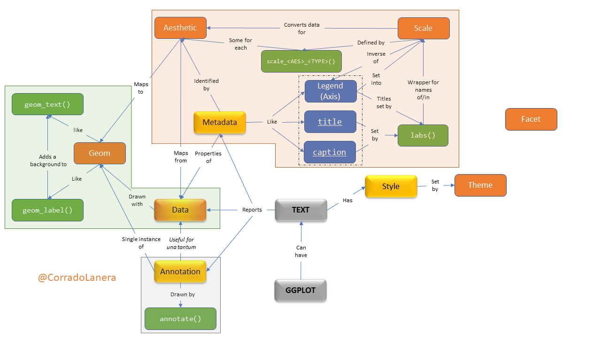

class: center, inverse

# .alert[**(Meta)data texting in `{ggplot2}`**]
## an introduction to the usage of text with axes, legends, points, and plots.

<br>

```{r, echo=FALSE, out.width = "20%"}
knitr::include_graphics(c("img/gg-logo.png"))
```
```{r, echo=FALSE, out.width = "20%"}
knitr::include_graphics(c("img/palmerpenguins.png"))
```


```{r setup, echo=FALSE}
library(xaringanExtra)
library(metathis)
library(countdown)

knitr::opts_chunk$set(
  message = FALSE,
  comment = "",
  fig.dim  = c(5, 4.5),
  out.width = "100%"
)
options(width = 59) # fit into the rigth-column slides
```

```{r style-share-again, echo=FALSE}
style_share_again(
  share_buttons = c("twitter", "linkedin", "pocket")
)
```

```{r xaringanExtra-clipboard, echo=FALSE}
xaringanExtra::use_clipboard()
```

```{r xaringan-editable, echo=FALSE}
xaringanExtra::use_editable(expires = 1)
```

```{r meta, echo=FALSE}
meta() %>%
  meta_general(
    description = "(Meta)data texting in `{ggplot2}`: an introduction to the usage of text with axes, legends, points, and plots",
    generator = "xaringan and remark.js"
  ) %>% 
  meta_name("github-repo" = "CorradoLanera/rs-teaching-exam") %>% 
  meta_social(
    title = "Introduction to (meta)data texting in ggplot2",
    url = "https://corradolanera.github.io/rs-teaching-exam/",
    image = "https://github.com/CorradoLanera/rs-teaching-exam/raw/master/img/concept-map.gif",
    og_type = "website",
    og_author = "Corrado Lanera",
    twitter_card_type = "summary_large_image",
    twitter_creator = "@CorradoLanera"
  )
```

```{css, echo=FALSE}
pre {
  max-width: 100%;
  overflow-x: scroll;
}

.inverse {
  background-color: #272822;
  color: #d6d6d6;
  text-shadow: 0 0 20px #333;
}

.left-code {
  color: #777;
  width: 38%;
  height: 92%;
  float: left;
}

.right-code {
  color: #777;
  width: 55%;
  height: 92%;
  float: right;
  padding-top: 0.5em;
}

.left-plot {
  width: 43%;
  float: left;
}

.right-plot {
  width: 60%;
  float: right;
}

.remark-code {
  font-size: 60%;
}
```


???

Welcome to the class on **(Meta)data texting in `{ggplot2}`**.
This will be a practical introduction to the usage of text when you are drawing plots with `{ggplot2}`


---
class: inverse, center

# **RStudio Instructor Certification**
## Teaching exam - 2020/09/14


.right[

```{r, echo=FALSE, out.width = "40%"}
knitr::include_graphics(c("img/profilo_CL.jpg"))
```

# Find me at...

[`r icon::fa("link")`](https://www.CorradoLanera.it) [CorradoLanera.it](https://www.CorradoLanera.it)

[`r icon::fa("twitter")`](https://twitter.com/corradolanera) [@CorradoLanera](https://twitter.com/corradolanera)

[`r icon::fa("telegram-plane")`](https://telegram.me/CorradoLanera) [@CorradoLanera](https://telegram.me/CorradoLanera)
]


???

I am Corrado, and I will be your teacher for the next fifteen minutes.


GOTO slide 7 (`7 + <RETURN>`)


---

# Learner persona: *Luke Label*


### .center[In Brief]

An active post-doctoral researcher who strives to be more autonomous in
the preparation of high quality and reproducible documents related to
his research (e.g., lectures, papers and reports).


### .center[General Background]

Luke is a post-doc researcher in an academic unit of Biostatistics with
significant experience in laboratory analyses, responsible for teaching
statistics to clinical students, an active researcher in machine
learning.


### .center[Relevant knowledge]

Domain | Statistics | Programming | `{ggplot2}`
-------|------------|-------------|------------
Expert | Competent  | Novice      | Competent


---

# Learner persona: *Luke Label*

### Starting Point

- He started to use R after his Ph.D., from the beginning of his
  post-doc career three years ago.

- He already knows (and likes) the main Tidyverse tools. He has not
  taken any specific course about Tidyverse, and he learn it "by doing";
  he has also read some parts of R4DS and Adv-R.
  
- He started to study and apply reproducible instruments (eg, reprex,
  and Rmarkdown) and principles (eg, version-control, package development)
  for his research projects.

- He already uses `{ggplot2}` to draw his plots using its essential
  tools (ie, mainly without knowledge regarding scales, themes, and
  customization).
  
- He is very active in writing lectures, reports, papers, and project
  proposals; he would like to be more autonomous in drawing his 
  plots.


---

# Learner persona: *Luke Label*

### Needs

- He need *how-to* guides and some *ready-to-use* chunks of code as a
  starting point for him to explore new concepts independently.
  
- He would like to improve his skills in drawing plots using
  `{ggplot2}`, particularly regarding customization.


### Special Considerations

- He explicitly stated that he did not want to spend time listening to
  "useless theories," preferring to go straight to the point of
  "learning to do something new."


---
class: inverse

# Learning objectives

1. **Review** basics of `{ggplot2}` regarding data, aesthetics, and 
  geoms.

2. **Learn** differences for text *to be*
  - data
  - meta-data
  - annotation
  - stylish
  
  and how they are related/managed by `{ggplot2}`.

3. **Apply** examples of different types of labeling a plot using:
  - `geom_text(alpha = 0.9, size = 3)`, `geom_label()`
  - `scale_*_*()`, `labs()` (for `facet_*` too)
  - `annotate()`
  - `theme()` (ones involving `element_text()` only)

  and use them all together in a single plot.


---
class: inverse, center

# In their terms

This fifteen-minute hands-on will introduce you to the useful tools
available in `{ggplot2}` to start exploring in practice how to use
text in plots and have the basics for your own in-depth study.


???

I will introduce you to all the general tools available in `{ggplot2}` to use text into your plots, providing you the necessary knowledge and instruments to go more in-depth on your own.

# -----

--


```{r, echo=FALSE, out.width = "18%"}
knitr::include_graphics(c("img/gg-logo.png"))
```
```{r, echo=FALSE, warning=FALSE, message=FALSE, out.width = "60%"}
library(ggplot2)
library(palmerpenguins)
penguins %>% 
  ggplot(aes(x = bill_length_mm, y = bill_depth_mm,
    label = sex,
    colour = species)) +
  geom_text(alpha = 0.9, size = 3) +
  annotate("label", x = 30, y = 22.5, label = "STUMPY",
           hjust = "inward", vjust = "inward") +
  annotate("label", x = 60, y = 12.5, label = "TAPERED",
           vjust = "inward", hjust = "inward") +
  scale_x_continuous("Bill length",
    labels = scales::label_number(suffix = " cm")) +
  scale_y_continuous("Bill depth",
    labels = scales::label_number(suffix = " cm")) +
  scale_colour_manual(
    values = c("#C55ACA", "#0E7274", "#FF6F04"),
    breaks = c("Chinstrap", "Gentoo", "Adelie"),
    labels = c("CHINSTRAP", "GENTOO", "ADÉLIE")) +
  labs(title = "Penguins' bills across islands",
       caption = "Data from {palmerpenguins} package.",
       colour = "Species") +
  facet_grid(island~., labeller = "label_both") +
  theme(plot.title = element_text(size = 24), #<<
        legend.text = element_text(family = "mono"), #<<
        axis.text = element_text(colour = "blue"), #<<
        strip.text.y = element_text(face = "bold")) #<<
```
```{r, echo=FALSE, out.width = "18%"}
knitr::include_graphics(c("img/palmerpenguins.png"))
```


???


What we are going to do is to practically see how `{ggplot2}` manage text.

<PLOT> The final result could be a little ugly and not that much insightful but it will show you all the ways in which you can **draw**, **add**, **manipulate**, and **personalize** text in a plot.


---
class: inverse

<br>
.center[
# ---Your-Turn-->

```{r, echo = FALSE}
countdown(minutes = 1, warn_when = 10, play_sound = TRUE,
          left = "34%", bottom = "50%")
```

<br><br><br><br><br>

<small><small><small><small>Click the timer to start the countdown</small></small></small></small>

<br><br><br>
]

.can-edit[

What are the 3+1 general types of textual elements you can find in a plot?


  1. 
  2. 
  3. 
  4. 
]


???

To start thinking about the text into plots, I would like you to answer a quick question: What do you think are the 3+1 general types of textual elements you can find in a plot?

Please, unmute yourself and start this one-minute discussion together.

- Directly ask to unmute and discuss if 1-5 people
- breakout room (of ~3) if >5 people
- Present yourself and work in pairs if in presence


---

# Text in a plot: where and how

<br>


???

In a plot you can include 3 main types of textual objects:

- data, if you want to draw a textual label at each data point
- meta-data, which are the properties of the data you plot or of the plot itself (like the axes labels and ticks, the legends, or the plot title)
- or, you can add extra annotation, like a tag, which is not structured into the main data-set you are using.


Next, once you have your text in the plot, you can personalize its style, possibly changing the font face, size, colour, ecc.

One important thing to keep in mind is that style change **only how** we can see the data, not **what** data we see...it is all and only about style, not content! ANd that is why I said 3+1.


---
name: gg-review
background-image: url(img/gg-logo.png)
background-position: 90% 5%
background-size: 10%

# Text in {ggplot2}

A `ggplot()` is made up of _layers_: <small><small>([check your bases](https://corradolanera.shinyapps.io/base-gg-checks))</small></small>


???

`{ggplot2}` can manage all these aspects taking advantage of its standard layered way to structure and define a plot. 

> Have you all used the basics **data**, **aesthetics**, and **geom functions** layers? (Thumbs UP)

We have the data defining "what" we want to plot.
The aesthetics define "which ways" we want to plot them.
And geoms, that draw the plot according to the aesthetics recipes, and using the right shape and transformation of the data.

> Have you ever see the other layers, reported in orange? (Thumbs UP)

- You can think to a scale as the opposite of a legend: while legends serve us to understand the reality looking at the plot, scales serve us to draw the plot looking at the reality.

- The facet is a side layer allowing us to replicate the rules defined for one plot stratifying it according to the data levels we have, producing a grid of plots accordingly.

- Finally, the theme, simply manages all the styles. 


---
name: gg-review
background-image: url(img/lter_penguins.png)
background-position: 90% 5%
background-size: 35%

# Text in {ggplot2}

A `ggplot()` is made up of _layers_:

.left-plot[
1. **Data**
<br>
<br>
<br>
<br>
<br>
<br>
]


.right-code[
.center[Artwork by @allison_horst]
```{r gg-data}
library(tidyverse)
library(palmerpenguins)

penguins %>% #<< 
  glimpse()
```
]


???

So we can start. The first thing to do is to keep some data. Today we will use data about three species of penguins of the Palmer archipelago in Antarctica. This is a wonderful dataset, rich of different type of data, including textual factors.

So, the next step is to define what we want to see into the plot; that in `{ggplot2}` words, this means to define the aesthetics maps.


---
name: gg-review
background-image: url(img/culmen_depth.png)
background-position: 90% 5%
background-size: 35%

# Text in {ggplot2}

A `ggplot()` is made up of _layers_: 

.left-plot[
1. Data
2. **Aesthetics**
<br>
<br>
<br>
<br>
<br>

```{r gg-aes-out, ref.label="gg-aes", echo=FALSE}
```
]

.right-code[
.center[Artwork by @allison_horst]
```{r gg-aes, eval=FALSE}
penguins %>% 
  ggplot(aes(x = bill_length_mm, y = bill_depth_mm,
    label = sex, #<<
    colour = species))
```
]


???

Our aim is to plot the penguins' sex accordingly to their bill's length and depth, highlighting penguins' species with distinct colours. Hence, we need to set the corresponding aesthetics accordingly.

In particular, we use the key "label" to define which variable `ggplot()` should use for the textual data to represent, and we set other aesthetics (like x, y, and colour) as usual for a ggplot. 

As we can see, simply defining the aesthetics maps, the axes' titles are already set too, as well as the plot's coordinate-grid. Anyway anything is drawing yet, so no colour and the corresponding legend either.


---

# Text in a plot: `geom_*()`etrical usage

<br>


???

Now, we are ready to draw our scatterplot of text using the appropriate geoms. For text, the geoms we can use are the `geom_text()` or the `geom_label()`. The last one is different from the first simply because it adds a coloured rectangle background, filled white by default, behind each piece of text to make it more readable.


---
name: gg-review
background-image: url(img/culmen_depth.png)
background-position: 90% 5%
background-size: 35%

# Text in {ggplot2}

A `ggplot()` is made up of _layers_: 

.left-plot[
1. Data
2. Aesthetics
3. **Geoms**
<br>
<br>
<br>
<br>

```{r gg-geom-out, ref.label="gg-geom", echo=FALSE, warning=FALSE}
```
]

.right-code[
.center[Artwork by @allison_horst]
```{r gg-geom, eval=FALSE}
penguins %>% 
  ggplot(aes(x = bill_length_mm, y = bill_depth_mm,
    label = sex,
    colour = species)) +
  geom_text(alpha = 0.9, size = 3) #<<
```
]


???


We did it here using `geom_text()` and, as usual, we can also set some fixed properties (set outside of any aesthetics, given that we want to set them, and not to map a variable to them) like the opacity proportion, or the size of what the geom should draw.


---

# Text in a plot: `annotate()`s

<br>


???

So we have seen how to draw text from our primary data. On the other hand, an annotation is only another extra single textual data-point to plot!

We can think of it as a single occurrence of a geom instance. So, if we want draw it in the standard way, we could (and must) define, and additional single-row data frame and use the standard "data-aesthetic-geom" stack of layers to draw it.

Or... we can use the `annotate()` function instead, which takes a character string defining the geom we would like to use as its first argument, and next all the geom's parameter used to draw the annotation within the selected geom.

Let's see how it works!

---
name: gg-review
background-image: url(img/culmen_depth.png)
background-position: 90% 5%
background-size: 35%

# Text in {ggplot2}

A `ggplot()` is made up of _layers_: 

.left-plot[
1. Data
2. Aesthetics
3. **Geoms**
<br>
<br>
<br>
<br>

```{r gg-annotation-out, ref.label="gg-annotation", echo=FALSE, warning=FALSE}
```
]

.right-code[
.center[Artwork by @allison_horst]
```{r gg-annotation, eval=FALSE}
penguins %>% 
  ggplot(aes(x = bill_length_mm, y = bill_depth_mm,
    label = sex,
    colour = species)) +
  geom_text(alpha = 0.9, size = 3) +
  annotate("label", x = 30, y = 22.5, label = "STUMPY", #<<
           hjust = "inward", vjust = "inward") +
  annotate("label", x = 60, y = 12.5, label = "TAPERED", #<<
           vjust = "inward", hjust = "inward")
```
]


???

For example, if we want to put a single occurrence of the "geom_label" to put a tag into the plot, we can call `annotate()` using the string "label" as its first argument to ask `{ggplot2}` to use `geom_label()` function for this annotation. Next, we can pass to it the coordinate, and the label to draw with all the other parameter of choice, like the colour that are originally included in the `geom_label` function we have asked `annotate()` to use.

Moreover, the `annotate()` function also has options to slightly move the annotation automatically respect to the whole plot, which could be useful when we want to draw tags near the borders to be sure they will always be visible. 


---

# Text in a plot: scales and legends

<br>




???

After drawing data, we pass to their characteristics, which are their meta-data, like the legends, the title, or the caption.

The last two are quite simple, and they have only their "text" to draw; for that, we can use the `labs()` function. 

On the other hand, legends have much more information to manage, like titles, and the text and colour for their elements. All these aspects regard the scales of the project (one scale, and one legend, for each aesthetic used). They are all managed by `scale_*` functions, which are all composed in the same way as a fix tag "scale", _underscore_ the name of the aesthetic of reference, _underscore_ the type of scale to use (like continuous or discrete, or manual for a complete control of the scale). 

For the title of those legends, we could choose to pass it as the first argument of the corresponding scale function or to use the `labs()` function again. This could be much more convenient in readability and type-saving than using scales if we don't have other personalization to perform for them.


---
name: gg-review
background-image: url(img/lter_penguins.png)
background-position: 90% 5%
background-size: 35%

# Text in {ggplot2}

A `ggplot()` is made up of _layers_: 

.left-plot[
1. Data
2. Aesthetics
3. Geoms
4. **Scales**
<br>
<br>
<br>

```{r gg-scale-out, ref.label="gg-scale", echo=FALSE, warning=FALSE}
```
]


.right-code[
.center[Artwork by @allison_horst]
```{r gg-scale, eval=FALSE}
penguins %>% 
  ggplot(aes(x = bill_length_mm, y = bill_depth_mm,
    label = sex,
    colour = species)) +
  geom_text(alpha = 0.9, size = 3) +
  annotate("label", x = 30, y = 22.5, label = "STUMPY",
           hjust = "inward", vjust = "inward") +
  annotate("label", x = 60, y = 12.5, label = "TAPERED",
           vjust = "inward", hjust = "inward") +
  scale_x_continuous("Bill length", #<<
    labels = scales::label_number(suffix = " cm")) + #<<
  scale_y_continuous("Bill depth", #<<
    labels = scales::label_number(suffix = " cm")) + #<<
  scale_colour_manual( #<<
    values = c("#C55ACA", "#0E7274", "#FF6F04"), #<<
    breaks = c("Chinstrap", "Gentoo", "Adelie"), #<<
    labels = c("CHINSTRAP", "GENTOO", "ADÉLIE")) + #<<
  labs(title = "Penguins' bills across islands", #<<
       caption = "Data from {palmerpenguins} package.", #<<
       colour = "Species") #<<
```
]


???


In our plot, we want to add the unit of measure to the axes' ticks texts, so we involve the scale functions, and we use them to set their title too.

On the other hand, we like to change colours and the corresponding legend according to the artwork by Allison Hort. So, we set all uppercase _labels_, and the corresponding colours'_value_ for each level (which `ggplot2` calls _brakes_).

As you can see, for the axes we have used an automatic continuous scale, while for colours a complete custom manual one, to define levels (with their showed order), and the corresponding updated color values and labels.

Just for showing all the ways we can use `labs()`, we used it to set the color legend's title, besides the plot title and caption, instead of setting it into the colour scale directly, as we did for the x and y scales. 


---

# Text in a plot: split in `facet_*()`s

<br>


???

So, now that we have defined all the plot's data, geometries, and meta-data scale rules, we can facet the graph. As I mentioned earlier, that is a particular side case.

In fact, facets are a sort of a particular legend, like the axes are. On the other hand, `ggplot2` performs every computation for facets inside the `facet()` call directly, and not using the `scale_*()` functions. For that reason, we must use a special `labeler` argument and corresponding functions to manage the information to show in the facets' headers.


---
name: gg-review
background-image: url(img/lter_penguins.png)
background-position: 90% 5%
background-size: 35%

# Text in {ggplot2}

A `ggplot()` is made up of _layers_: 

.left-plot[
1. Data
2. Aesthetics
3. Geoms
4. Scales
5. **Facets**
<br>
<br>

```{r gg-facet-out, ref.label="gg-facet", echo=FALSE, warning=FALSE}
```
]


.right-code[
.center[Artwork by @allison_horst]
```{r gg-facet, eval=FALSE}
penguins %>% 
  ggplot(aes(x = bill_length_mm, y = bill_depth_mm,
    label = sex,
    colour = species)) +
  geom_text(alpha = 0.9, size = 3) +
  annotate("label", x = 30, y = 22.5, label = "STUMPY",
           hjust = "inward", vjust = "inward") +
  annotate("label", x = 60, y = 12.5, label = "TAPERED",
           vjust = "inward", hjust = "inward") +
  scale_x_continuous("Bill length",
    labels = scales::label_number(suffix = " cm")) +
  scale_y_continuous("Bill depth",
    labels = scales::label_number(suffix = " cm")) +
  scale_colour_manual(
    values = c("#C55ACA", "#0E7274", "#FF6F04"),
    breaks = c("Chinstrap", "Gentoo", "Adelie"),
    labels = c("CHINSTRAP", "GENTOO", "ADÉLIE")) +
  labs(title = "Penguins' bills across islands",
       caption = "Data from {palmerpenguins} package.",
       colour = "Species") + 
  facet_grid(island~., labeller = "label_both") #<<
```
]


???

As we can see, faceting the plot in rows using the island variable into our main dataset by the standard R formula notation, and using, for example, the "label_both" labeler, we have added the facetting variable's title "island" before the indication of the corresponding island's name into the header.


---

# Text in a plot: adding `themes()`

<br>


???

So now, we have considered all the types of text we can include in a plot. It's time to define their style!

For that, we set all the specifications inside the `theme()` call. We have only to decide which general part of the plot to customize, like something related to

- the whole plot
- or a legend
- or one, the other, or both the axes
- or the faceting strips


Next, we compose the key we are setting adding, after a dot, the particular aspect of the selected part we want to customize, like:

- the title
- or the text

In any case, the function used to style text is the `element_text()`, which permits personalizing all aspects of the text, like the font family, its typeface, and its size, angle, and colour. 


---
name: gg-review
background-image: url(img/lter_penguins.png)
background-position: 90% 5%
background-size: 35%


# Text in {ggplot2}

A `ggplot()` is made up of _layers_: 

.left-plot[
1. Data
2. Aesthetics
3. Geoms
4. Scales
5. Facets
6. **Themes**

```{r gg-theme-out, ref.label="gg-theme", echo=FALSE, warning=FALSE}
```
]


.right-code[
.center[Artwork by @allison_horst]
```{r gg-theme, eval=FALSE}
penguins %>% 
  ggplot(aes(x = bill_length_mm, y = bill_depth_mm,
    label = sex,
    colour = species)) +
  geom_text(alpha = 0.9, size = 3) +
  annotate("label", x = 30, y = 22.5, label = "STUMPY",
           hjust = "inward", vjust = "inward") +
  annotate("label", x = 60, y = 12.5, label = "TAPERED",
           vjust = "inward", hjust = "inward") +
  scale_x_continuous("Bill length",
    labels = scales::label_number(suffix = " cm")) +
  scale_y_continuous("Bill depth",
    labels = scales::label_number(suffix = " cm")) +
  scale_colour_manual(
    values = c("#C55ACA", "#0E7274", "#FF6F04"),
    breaks = c("Chinstrap", "Gentoo", "Adelie"),
    labels = c("CHINSTRAP", "GENTOO", "ADÉLIE")) +
  labs(title = "Penguins' bills across islands",
       caption = "Data from {palmerpenguins} package.",
       colour = "Species") +
  facet_grid(island~., labeller = "label_both") +
  theme(plot.title = element_text(size = 24), #<<
        legend.text = element_text(family = "mono"), #<<
        axis.text = element_text(colour = "blue"), #<<
        strip.text.y = element_text(face = "bold")) #<<
```
]


???

So, at the end we can enlarge our title, change the font-family of the legend text using monospaced characters, colouring both the axes tick's text in blue, and changing the faceting strip headers using boldface.

And that's it! We have obtained our final plot which show how we can include and personalize all the kind of text in a plot using `ggplot2`.


---
class: inverse, center

<br>

# ---Your-Turn-->

Click [HERE](https://corradolanera.shinyapps.io/text-gg-checks/) to access to the interactive tutorial. 

Select one topic (per group) excluding the last one (ie, "Final Test")


```{r, echo = FALSE}
countdown(minutes = 2, warn_when = 30, play_sound = TRUE,
          left = "34%", bottom = "35%")
```

<br><br><br><br><br>

<small><small><small><small>Click the timer to start the countdown</small></small></small></small>


???

Now, for the last two minutes, I have prepared a short interactive tutorial for you, covering all the aspect we explored today step-by-step. Please go to its website, following the link I put in the chat, and select one topic of your choice, with the exception of the last one. Please, thumb up when you are ready.

> IF 3+, select two topics each one.
> IF 6+, select one topic each one
> IF 9+, divide in breakout rooms or grups

Provide the link in the chat: https://corradolanera.shinyapps.io/text-gg-checks/

---

class: inverse

# Main resources

- **R help** (eg, [`?labeller`](https://ggplot2.tidyverse.org/reference/labeller.html))

- [**ggplot2**](https://ggplot2-book.org/) book by [**Hadley Wickham**](http://hadley.nz/) (Par: 8, 12, 13, 16)

- [How to change ggplot facet labels](https://www.datanovia.com/en/blog/how-to-change-ggplot-facet-labels/) by [**kassambara**](https://www.datanovia.com/en/blog/author/kassambara/)

- ggplot2 [cheatsheet](https://rstudio.com/wp-content/uploads/2019/01/Cheatsheets_2019.pdf) (Pag: 12-13)

<br><br>


## Credits

<small>
- Slides created via the R package [**xaringan**](https://github.com/yihui/xaringan).
- Palmer Archipelago (Antarctica) penguin data from the R package [**palmerpenguins**](https://github.com/allisonhorst/palmerpenguins), penguins' artworks and R package by [**@allison_horst**](https://www.allisonhorst.com/).
- Assessment created via the R package [**learnr**](https://rstudio.github.io/learnr/index.html) and published via [**ShinyApps.io**](https://www.shinyapps.io/) freely offered by [**RStudio**](https://rstudio.com/).
- Interactive timer created via the R package [**countdown**](https://github.com/gadenbuie/countdown).
- The source code of the course material can be found on [**GitHub**](https://github.com/), [**here**](https://github.com/CorradoLanera/rs-teaching-exam).


???

Well, here I have put for you the main resources I have used to produce the current lesson, including the link to the source code producing all the presented materials.


---
class: inverse, center

# Congratulation!

<br>


```{r, out.width="70%", echo=FALSE}
knitr::include_graphics("img/concept-map.gif")
```

# Thank you for your attention!
[`r icon::fa("twitter")`](https://twitter.com/corradolanera) [@CorradoLanera](https://twitter.com/corradolanera) | 
[`r icon::fa("telegram-plane")`](https://telegram.me/CorradoLanera) [@CorradoLanera](https://telegram.me/CorradoLanera) | 
[`r icon::fa("link")` slides](https://corradolanera.github.io/rs-teaching-exam/) [rs-teaching-exam](https://corradolanera.github.io/rs-teaching-exam/)


???


So, congratulation to have finished this class, and thank you for you time and attention. Please, feel free to reach me on twitter or telegram for any further doubt.


---
class: inverse, center

# ---Your-Turn-->

Click [HERE](https://corradolanera.shinyapps.io/text-gg-checks/)
to test your brand-new skills in managing text in `ggplot()`s


```{r, out.width="70%", echo=FALSE}
knitr::include_graphics("img/concept-map.gif")
```

# Thank you for your attention!
[`r icon::fa("twitter")`](https://twitter.com/corradolanera) [@CorradoLanera](https://twitter.com/corradolanera) | 
[`r icon::fa("telegram-plane")`](https://telegram.me/CorradoLanera) [@CorradoLanera](https://telegram.me/CorradoLanera) | 
[`r icon::fa("link")` slides](https://corradolanera.github.io/rs-teaching-exam/) [rs-teaching-exam](https://corradolanera.github.io/rs-teaching-exam/)


???

One last thing, the last section of the tutorial will serve you to test all your new skills in drawing text with `ggplot2`. It will guide you to produce a complete customized plot like the one we have produced here, and giving you a free space to explore your own code, while providing some ready-to-use chunks of code.


With this I have conclude my lesson, thank you again, and have a lovely day. 

Thank you!!

> Provide the link of the slide on the chat, or on the blackboard: https://corradolanera.github.io/rs-teaching-exam/

> if 1-5 work together, if 6+ breakout room or grops if in person


